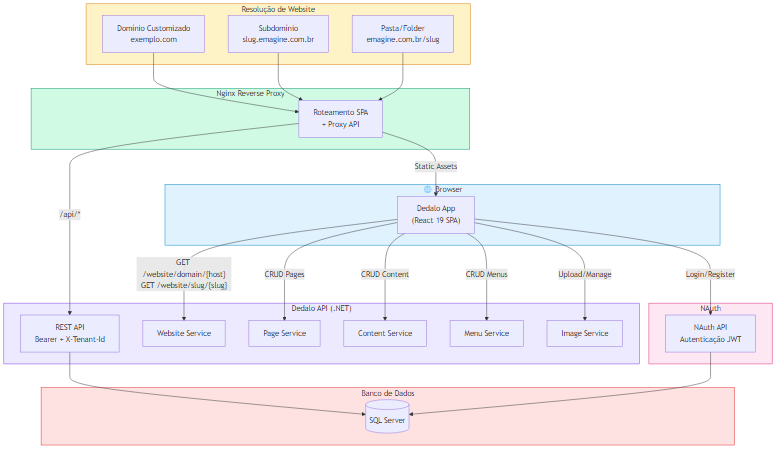

# Dedalo App - CMS Multi-Tenant Frontend


## Overview

**Dedalo App** é o frontend de um CMS multi-tenant que renderiza websites dinamicamente com base na resolução de URL (domínio customizado, subdomínio ou pasta). Construído com **React 19**, **TypeScript**, **Vite 8** e **Tailwind CSS 4**, oferece edição visual de conteúdo com drag-and-drop, sistema de templates e gerenciamento completo de páginas e menus.

Faz parte do ecossistema **Emagine**, integrando-se com a **Dedalo API** (backend .NET) e o **NAuth** (autenticação JWT).

---

## 🚀 Features

- 🌐 **Resolução Multi-Tenant** — Websites resolvidos por domínio customizado, subdomínio ou pasta na URL
- ✏️ **Edit Mode** — Edição visual de conteúdo com drag-and-drop (dnd-kit) disponível apenas para o dono do website
- 🧩 **Sistema de Templates** — Templates registráveis com layouts, áreas de conteúdo e componentes customizados
- 📄 **Gerenciamento de Páginas** — CRUD completo com suporte a múltiplos templates de página por tema
- 📋 **Gerenciamento de Menus** — Menus hierárquicos com suporte a links internos, externos e criação automática de páginas
- 🖼️ **Componentes de Conteúdo** — Hero, Texto, Imagem, Galeria, Vídeo e Formulário com editores visuais
- 🔐 **Autenticação NAuth** — Login, registro, recuperação de senha e perfil de usuário integrados
- 🎨 **Tailwind CSS 4** — Estilização moderna com utilitários CSS

---

## 🛠️ Tecnologias Utilizadas

### Core
- **React 19** — Biblioteca de UI com hooks e context API
- **TypeScript 5.9** — Tipagem estática com `erasableSyntaxOnly`
- **Vite 8** — Bundler e dev server com HMR

### Estilização
- **Tailwind CSS 4** — Framework CSS utilitário (com plugin Vite nativo)

### Roteamento e Estado
- **React Router DOM 7** — Roteamento SPA
- **React Context** — Gerenciamento de estado (Website, Page, Menu, Content, EditMode)

### Drag-and-Drop
- **@dnd-kit/core 6** — Framework de drag-and-drop acessível
- **@dnd-kit/sortable 10** — Extensão para listas ordenáveis

### Autenticação
- **nauth-react 0.7** — Componentes e hooks de autenticação JWT

### UI
- **Lucide React** — Biblioteca de ícones
- **Sonner** — Notificações toast

### DevOps
- **Nginx** — Reverse proxy para SPA + API
- **GitHub Actions** — CI/CD para deploy em produção

---

## 📁 Estrutura do Projeto

```
dedalo-app/
├── src/
│   ├── assets/                  # Imagens estáticas
│   ├── components/
│   │   ├── auth/                # AuthPanel, UserMenu
│   │   ├── content/             # Componentes renderizáveis (Hero, Text, Image, etc.)
│   │   ├── content-editors/     # Editores modais por tipo de conteúdo
│   │   ├── editor/              # UI do Edit Mode (drag-and-drop, pickers, toggles)
│   │   ├── layout/              # Header, Footer, Navigation, MenuBuilder
│   │   └── ui/                  # Componentes reutilizáveis (Modal)
│   ├── contexts/                # React Context providers
│   ├── hooks/                   # Custom hooks (useWebsite, usePage, etc.)
│   ├── services/                # Camada de API (fetch wrapper + services)
│   ├── templates/               # Sistema de templates (starter-blog, business)
│   ├── types/                   # Interfaces TypeScript
│   ├── App.tsx                  # Componente raiz com providers e rotas
│   ├── main.tsx                 # Entry point React
│   └── index.css                # Estilos globais
├── docs/                        # Documentação do projeto
├── public/                      # Assets estáticos
├── .github/workflows/           # Pipelines CI/CD
├── nginx.conf                   # Configuração Nginx
├── .env.example                 # Template de variáveis de ambiente
├── vite.config.ts               # Configuração Vite
└── package.json                 # Dependências e scripts
```

---

## 🏗️ System Design

O diagrama abaixo ilustra a arquitetura de alto nível do **Dedalo App**:



### Fluxo de Resolução de Website

1. **Domínio customizado** — `exemplo.com` → `GET /website/domain/{hostname}`
2. **Subdomínio** — `slug.emagine.com.br` → `GET /website/slug/{slug}`
3. **Pasta** — `emagine.com.br/slug` → `GET /website/slug/{slug}`

O Nginx roteia assets estáticos diretamente e faz proxy das chamadas `/api/*` para o backend. O React SPA resolve qual website exibir com base na URL.

> 📄 **Fonte:** O arquivo Mermaid editável está em [`docs/system-design.mmd`](docs/system-design.mmd).

---

## 📖 Documentação Adicional

| Documento | Descrição |
|-----------|-----------|
| [DEDALO_API_DOCUMENTATION](docs/DEDALO_API_DOCUMENTATION.md) | Especificação completa da API REST (endpoints, autenticação, modelos) |

---

## ⚙️ Configuração do Ambiente

### 1. Copie o template de variáveis

```bash
cp .env.example .env
```

### 2. Edite o arquivo `.env`

```bash
VITE_API_URL=https://localhost:44374       # URL base da Dedalo API
VITE_NAUTH_API_URL=https://localhost:44374 # URL da API de autenticação NAuth
VITE_TENANT_ID=default                     # Identificador do tenant (header X-Tenant-Id)
VITE_BASE_DOMAIN=emagine.com.br            # Domínio base para resolução por subdomínio/pasta
```

⚠️ **IMPORTANTE**:
- Nunca faça commit do arquivo `.env` com credenciais reais
- Apenas o `.env.example` deve ser versionado

---

## 🔧 Setup Local

### Pré-requisitos
- **Node.js** 18+
- **npm** 9+

### Instalação

```bash
# 1. Clone o repositório
git clone https://github.com/emaginebr/dedalo-app.git
cd dedalo-app

# 2. Instale as dependências
npm install

# 3. Configure as variáveis de ambiente
cp .env.example .env
# Edite o .env com as URLs corretas

# 4. Inicie o servidor de desenvolvimento
npm run dev
```

### Scripts Disponíveis

| Comando | Descrição |
|---------|-----------|
| `npm run dev` | Servidor de desenvolvimento com HMR |
| `npm run build` | Type check (tsc) + build de produção |
| `npm run lint` | Executa ESLint em todos os arquivos TS/TSX |
| `npm run preview` | Preview do build de produção |
| `npx tsc --noEmit` | Verificação de tipos sem output |

### Acesso durante desenvolvimento

Em modo de desenvolvimento, a resolução funciona por **pasta**:

```
http://localhost:5173/meu-site      → resolve o website com slug "meu-site"
http://localhost:5173/_/new         → formulário de criação de website
```

---

## 📚 Arquitetura da Aplicação

### Camada de Tipos (`src/types/`)

Interfaces TypeScript que espelham os modelos da API. Enums utilizam objetos `as const` (não `enum` do TS) devido à flag `erasableSyntaxOnly` no tsconfig.

### Camada de Serviços (`src/services/`)

`api.ts` é um wrapper de `fetch` que injeta automaticamente os headers `Authorization` (Bearer do localStorage) e `X-Tenant-Id`. O método `getSafe()` retorna `null` em vez de lançar exceções — usado por todos os endpoints públicos.

### Camada de Contextos (`src/contexts/`)

Providers React para Website, Page, Menu, Content e EditMode. Hierarquia de providers:

```
BrowserRouter → NAuthProvider → WebsiteProvider → PageProvider → MenuProvider → ContentProvider → EditModeProvider
```

### Sistema de Templates (`src/templates/`)

Cada template define páginas com áreas de conteúdo e componentes customizados. Templates disponíveis:
- **starter-blog** — Template de blog com sidebar
- **business** — Template corporativo com múltiplas colunas

### Edit Mode (`src/components/editor/`)

Disponível apenas para o dono do website (`user.userId === website.userId`). Habilita drag-and-drop de conteúdo, edição inline, gerenciamento de menus e configuração de páginas.

---

## 🔒 Segurança

### Autenticação
- **Bearer Token JWT** — Armazenado no localStorage como `nauth_session`
- **Multi-Tenant** — Header `X-Tenant-Id` enviado em todas as requisições
- **Edit Mode Protegido** — Apenas o dono do website pode ativar a edição

### Padrões
- Endpoints públicos usam `getSafe()` (nunca expõem erros)
- Conteúdo armazenado como JSON serializado em `ContentInfo.contentValue`

---

## 🔄 CI/CD

### GitHub Actions

**Deploy de Produção** (`deploy-prod.yml`):
- Trigger: manual (workflow_dispatch)
- Deploy via SSH com docker-compose
- Secrets necessários: SSH credentials, connection strings, JWT secrets

**Versionamento** (`version-tag.yml`, `create-release.yml`):
- Tagging automático via GitVersion
- Criação de releases no GitHub

---

## 🤝 Contribuindo

Contribuições são bem-vindas! Para contribuir:

1. Faça um fork do repositório
2. Crie uma branch para sua feature (`git checkout -b feature/MinhaFeature`)
3. Faça suas alterações
4. Execute o lint (`npm run lint`)
5. Faça commit (`git commit -m 'Adiciona MinhaFeature'`)
6. Push para a branch (`git push origin feature/MinhaFeature`)
7. Abra um Pull Request

### Padrões de Código

- Texto e comentários em **Português (pt-BR)**
- Enums como objetos `as const` (não `enum`)
- Endpoints públicos sempre com `getSafe()` (retorna `null`, não lança exceções)
- Componentes de conteúdo parseiam seu próprio JSON de `contentValue`

---

## 👨‍💻 Autor

Desenvolvido por **[Emagine](https://github.com/emaginebr)**

---

## 📄 Licença

Este projeto está licenciado sob a **MIT License** — veja o arquivo [LICENSE](LICENSE) para detalhes.

---

**⭐ Se este projeto foi útil para você, considere dar uma estrela!**
